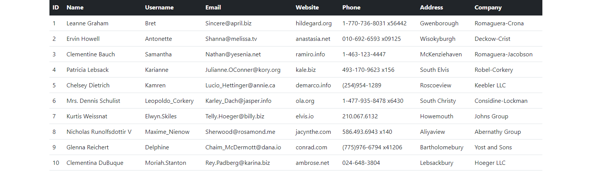
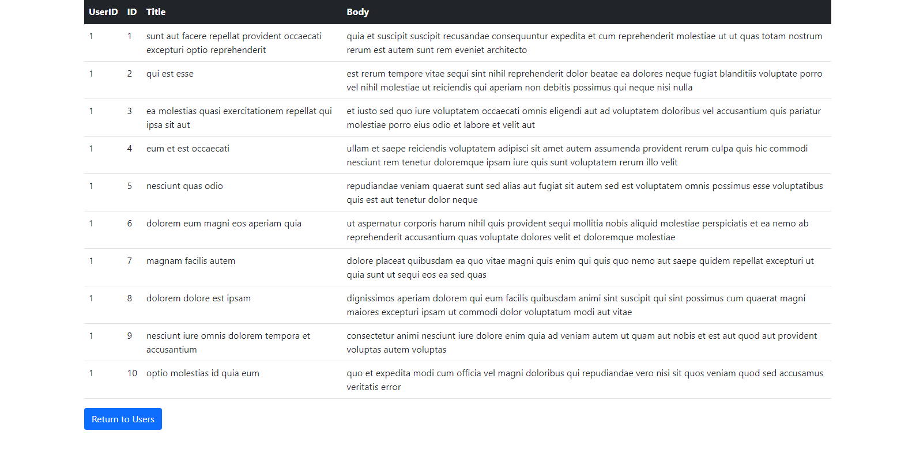

# Coding Challenge V2 Description

## Coding Challenge V2 Hosted on GitHub Pages [Here](https://xiraynedev.github.io/coding-challenge-v2/)

This coding challenge has an index.html file that has tables with non-changing content. The browser loads a JavaScript module file
that makes API requests to retrieve JSON data. The data is then used to populate the user table with information pertaining to each user.
The user table uses event delegation to determine which DOM element was clicked. If the element is a user, then an API request is made using
the user's ID to retrieve a list of posts pertaining to that user. It then displays the post information in the posts table. A back button is 
shown with the posts to return to the user table. The HTML is styled with Bootstrap and one simple CSS external stylesheet. This version of the 
coding challenge uses ES6 modules.

---

---

---

